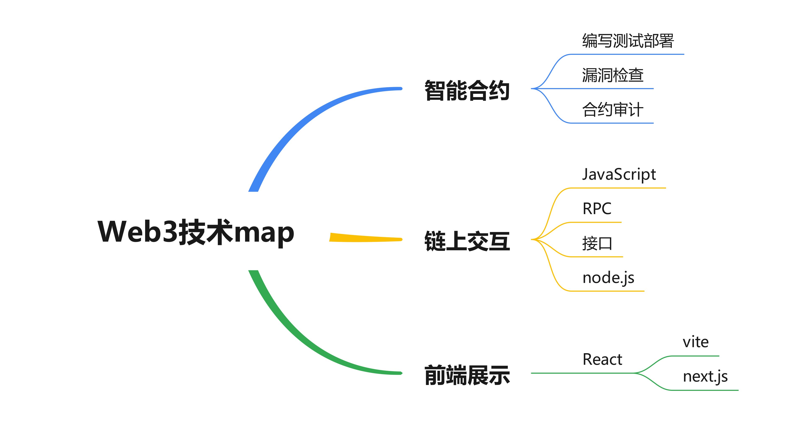

# Backdrop

> 感谢[@pollo](https://x.com/pollowinworld)的督促，我开始了web3的灵山取经之路，话说回来，地理意义上的灵山在2023年的浙大链协破冰时已经去过了，但这次要独自求取真经了！

之前也写了一些文档，也学了一些，用飞书写的，但是总得来说飞书这个软件验证登录比较麻烦不如本地仓库写起来舒服，只是说便于分享，但是`gitbook`倒是可以解决这个问题。

ToDo List：

- [ ] 最终决定做一个官网来展示这一部分的教程吧，OnePolloWeb3 Academy 启动！

进入Web3的技术领域分为几个部分，一个是 [智能合约](./smart_contract/README.md) 、一个是 [链上交互](./chain_interaction/README.md) 、还有一个是 [前端交互](./Front-end_Interaction/README.md) 。

下面就分3个文件夹深入这三个领域进行学习了！

至于综合学习，我认为吃透几个开源的黑客松项目就足够了，2024年的黑客松有深圳的，后续再找一点：

> 点开这个汇总名单，阅读每个项目的介绍，然后点击进入各自的项目仓库，克隆或下载然后在本地能够修改运行吃透这个项目

- ETH-Shenzhen-2024：https://github.com/openbuildxyz/ETH-Shenzhen-2024