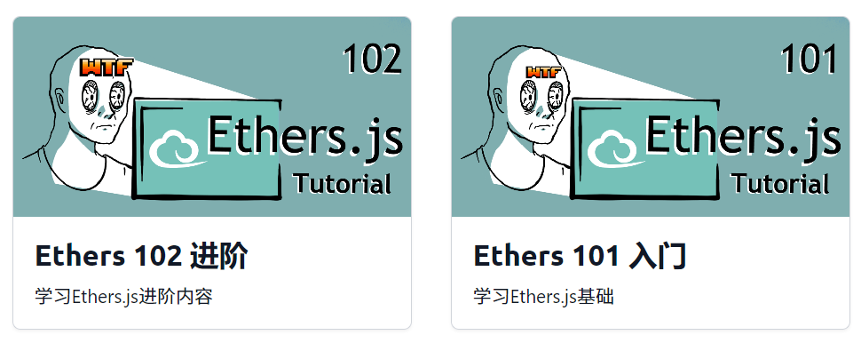

# 欢迎来到链上交互课程

链上交互主要包括数据分析和替代钱包操作，在2023年10月铭文热的时候，能够写脚本打铭文就是捡钱，值得一学！

## 教程

- ehters.js：https://docs.ethers.org/v6/
- Ethers.js 101 入门：https://www.wtf.academy/docs/ethers-101
  - 

- web3.js：https://web3js.readthedocs.io/en/v1.10.0/