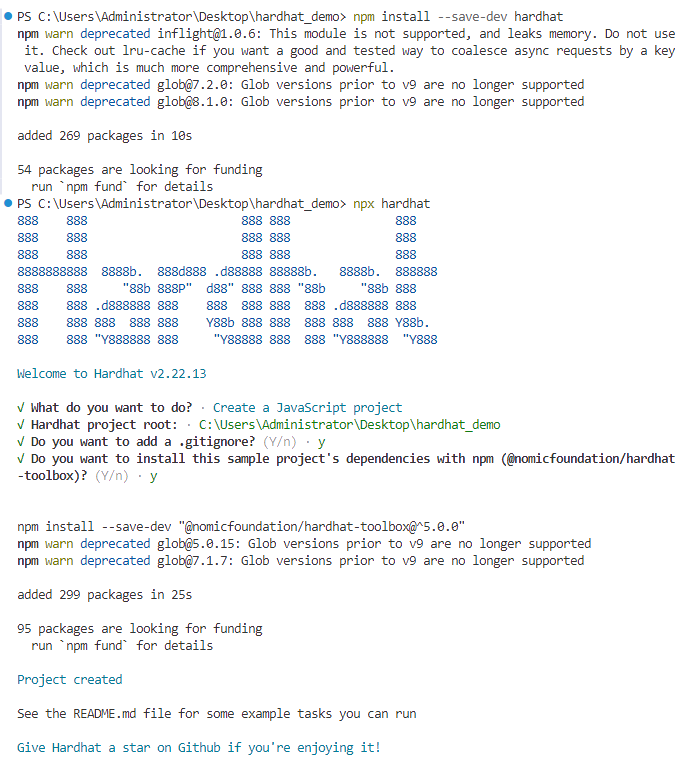
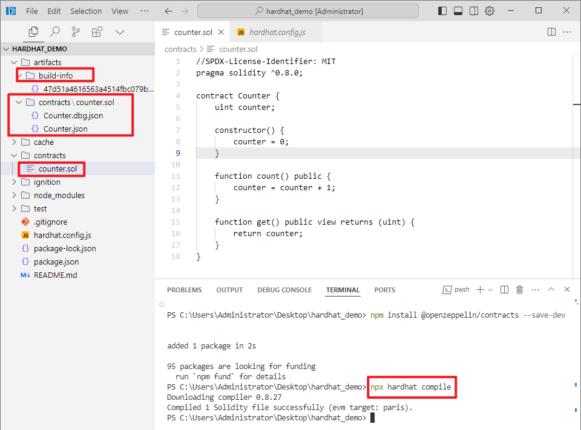

# 从零开始创建一个Hardhat项目

## 创建及配置Hardhat项目

Hardhat 构建在 Node.js 之上， 使用 Hardhat 要求我们在电脑先安装好Node.js (>= 16.0)， 环境准备可以参考[这里](https://learnblockchain.cn/docs/hardhat/tutorial/setting-up-the-environment.html)。

先创建项目目录：

```bash
mkdir hardhat-tutorial
cd hardhat-tutorial
```

初始化 Node 项目：

```bash
npm init
```


安装 Hardhat :

```bash
npm install --save-dev hardhat
```

在安装**Hardhat**的目录下运行：

```bash
npx hardhat
```

使用键盘选择"创建一个 JavaScript 工程（`Create a JavaScript project`）" ，然后回车。



这个 JavaScript Hardhat 工程会默认下载 `hardhat-toolbox 插件`及一些常规设置：

创建好的 Hardhat 工程包含下列文件：

- `contracts`：智能合约目录
- `scripts` ：部署脚本文件
- `test`：智能合约测试用例文件夹。
- `hardhat.config.js`：配置文件，配置hardhat连接的网络及编译选项。

## 编写合约

合约开发推荐使用  `VSCode` / `Cursor` 编辑器 + [solidity 插件](https://marketplace.visualstudio.com/items?itemName=NomicFoundation.hardhat-solidity)，在`contracts` 下新建一个合约文件 `Counter.sol` (`*.sol` 是 Solidity 合约文件的后缀名), 复制如下代码：`counter.sol`

```js
//SPDX-License-Identifier: MIT
pragma solidity ^0.8.0;

contract Counter {
    uint counter;

    constructor() {
        counter = 0;
    }

    function count() public {
        counter = counter + 1;
    }

    function get() public view returns (uint) {
        return counter;
    }
}
```

接下来就可以编译这个合约了。

## 编译合约

`hardhat.config.js` 有默认的Solidity 编译器配置：`hardhat.config.js`

```solidity
require("@nomicfoundation/hardhat-toolbox");

/** @type import('hardhat/config').HardhatUserConfig */
module.exports = {
  solidity: "0.8.27",
};
```

因此我们直接编译合约即可，在终端中运行 `npx hardhat compile` 。 `compile`任务是内置任务之一。

```applescript
$ npx hardhat compile
Downloading compiler 0.8.27
Compiled 1 Solidity file successfully (evm target: paris).
```

合约已成功编译了。

成功编译后，会在 `artifacts/contracts/` 目录下生成`Counter.json` 和 build-info， `Counter.json`包含了智能合约的 ABI 、字节码（Bytecode）等。

> 提示
>
> 智能合约的 **ABI（Application Binary Interface）**信息，其中包括了合约的函数、事件等接口信息。这个文件通常会在与其他合约交互时使用，因为它可以被其他合约和 DApp 使用。
>
> `Bytecode `是部署合约所需的字节码（也称为创建时字节码），部署合约时，就是把该字节码作为交易的输入数据发送链上。



## 编写测试用例

为智能合约编写自动化测试至关重要，因为事关用户资金。

在我们的测试中，使用 Harhdat 内置的网络，使用[ethers.js](https://learnblockchain.cn/ethers_v5/)与前面的合约进行交互，并使用 [Mocha](https://mochajs.org/) 作为测试运行器。

在项目 `test`下，并创建一个名为`Counter.js`的新文件：`./test/Counter.js`

```js
const { ethers } = require("hardhat");
const { expect } = require("chai");

let counter;

describe("Counter", function () {
  async function init() {
    const [owner, otherAccount] = await ethers.getSigners();
    const Counter = await ethers.getContractFactory("Counter");
    counter = await Counter.deploy();
    await counter.waitForDeployment();
    console.log("counter:" + await counter.getAddress());
  }

  before(async function () {
    await init();
  });

  // 
  it("init equal 0", async function () {
    expect(await counter.get()).to.equal(0);
  });

  it("add 1 equal 1", async function () {
    let tx = await counter.count();
    await tx.wait();
    expect(await counter.get()).to.equal(1);
  });

});
```

在终端上运行`npx hardhat test`。 你应该看到以下输出：


这意味着测试通过了。 现在我们解释下主要代码：

```js
const Counter = await ethers.getContractFactory("Counter");
```

ethers.js中的`ContractFactory`是用于部署新智能合约的抽象，因此此处的`Counter`是用来实例合约的工厂。

```js
counter = await Counter.deploy();
```

在`ContractFactory`上调用`deploy()`将启动部署，并返回解析为`Contract`的`Promise`。 该对象包含了智能合约所有函数的方法。

```solidity
let tx = await counter.count();
await tx.wait();
```

在`counter` 上调用合约方法， 并等待交易执行完毕。

注意，默认情况下， `ContractFactory`和`Contract`实例连接到第一个[签名者（Singer）](https://learnblockchain.cn/ethers_v5/)。

若需要使用其他的签名者， 可以使用[合约实例connect 到另一个签名者](https://learnblockchain.cn/ethers_v5/api/contract/example/#example-erc-20-contract--methods)， 如 `counter.connect(otherAccount)`

```js
expect(await counter.get()).to.equal(0);
```

判断相等，我们使用[Chai](https://www.chaijs.com/)，这是一个断言库。 这些断言函数称为“匹配器”，在此实际上使用的“匹配器”来自[Hardhat Chai Matchers](https://hardhat.org/hardhat-runner/plugins/nomicfoundation-hardhat-chai-matchers)。

## 使用 Console.log 调试合约

在**Hardhat Node** 节点上运行合约和测试时，你可以在Solidity代码中调用`console.log()`打印日志信息和合约变量，可以方便我们调试代码。

在合约代码中导入**Hardhat** 的`console.log`就可以使用它。

```solidity
import "hardhat/console.sol";
```

导入语法如上，

**本文对应的代码仓库**在：https://github.com/ranxi2001/hardhat_demo

文档对应的**合约和测试代码**可直接在**下面链接处复制**（需要对应静态和 *动态版本——参数构造函数*）：

> **静态版本**：
>
> - 合约：
>   - https://github.com/ranxi2001/hardhat_demo/blob/master/contracts/counter_static.sol
> - 测试：
>   - https://github.com/ranxi2001/hardhat_demo/blob/master/test/Counter_static.js
>
> **动态版本**：
>
> - 合约：
>   - https://github.com/ranxi2001/hardhat_demo/blob/master/contracts/counter_dynamic.sol
> - 测试：
>   - https://github.com/ranxi2001/hardhat_demo/blob/master/test/Counte_dynamic.js

就像在JavaScript中使用一样, 将一些`console.log`添加到函数中，运行测试时，将输出日志记录：


可以在[这里](https://learnblockchain.cn/docs/hardhat/hardhat-network/#console-log)了解更多 console.log 。

## 部署合约

### 本地部署

其实我们在测试时， 合约已经部署到了Hardhat 内置的网络上，部署合约我们需要编写一个部署脚本。

在`scripts`文件夹，新建一个`deploy.js` 用来写部署脚本，部署脚本其实和前面测试时 `init` 函数类似：

```js
const { ethers } = require("hardhat");

async function main() {

    const Counter = await ethers.getContractFactory("Counter");
    const counter = await Counter.deploy();
    await counter.deployed();

    console.log("Counter address:", counter.address);
}

main();
```

运行 `npx hardhat run scripts/deploy.js` 时，合约会部署到 Hardhat 内置网络上。

```solidity
> npx hardhat run scripts/deploy.js
Compiled 1 Solidity file successfully (evm target: paris).
CounterStatic address: 0x5FbDB2315678afecb367f032d93F642f64180aa3
CounterDynamic address: 0xe7f1725E7734CE288F8367e1Bb143E90bb3F0512
```

### 链上部署

为了在运行任何任务时指示**Hardhat**连接到特定的EVM网络，可以使用`--network`参数。 像这样：

```js
npx hardhat run scripts/deploy.js --network <network-name>
```

`network-name` 需要在 `hardhat.config.js` 文件中进行配置：

配置文件的写法可以参考官网：https://hardhat.org/hardhat-runner/docs/config

```js
require("@nomicfoundation/hardhat-toolbox");

// 填入自己的私钥或助记词，
const PRIVATE_KEY1 = "0x.... YOUR PRIVATE KEY1";
const PRIVATE_KEY2 = "0x....  YOUR PRIVATE KEY1";
const Mnemonic = "YOUR Mnemonic";


module.exports = {
  solidity: "0.8.0", // solidity的编译版本
  networks: {
    goerli: {
      url: "https://sepolia.infura.io/v3/<key>",
      accounts: [PRIVATE_KEY1,PRIVATE_KEY2],
      chainId: 5,
    },
    
     mumbai: {
      url: "https://endpoints.omniatech.io/v1/matic/mumbai/public",
      accounts: {
        mnemonic: Mnemonic,
      },
      chainId: 80001,
    },
  }
};
```

以上配置了两个网络，一个是以太坊测试网 `goerli`， 一个是 Polygon 测试网`mumbai`， 我们可以在 [https://chainlist.org](https://chainlist.org/) 找到每个网络的节点 URL 及 chainID。

在网络配置中，需要提供`钱包交易账户`， 可以通过`私钥`或`助记词` 进行配置，这里配置的账号（需要提前充币进入到账号中），在hardhat 脚本中（测试及部署脚本）调用`getSigners` 即可获得：

```solidity
const [owner, otherAccount] = await ethers.getSigners();
```

一个私钥对应一个Singer，助记词则对应无数个 Singer ， 为每个项目生成一个独立的账号是比较推荐的做法，使用 [ChainTool 开源工具](https://chaintool.tech/generateWallet) 可以生成账号。

> **提示**
>
> 助记词可以推导出无数了私钥，可参考：[BIP39](https://learnblockchain.cn/2018/09/28/hdwallet)

另外要注意， 在 Goerli 上进行部署，需要将Goerli-ETH发送到将要进行部署的地址中。 可以从水龙头免费获取一些测试币，这是Goerli的一个水龙头:

- [Alchemy Goerli Faucet](https://goerlifaucet.com/)

最后运行：

```solidity
npx hardhat run scripts/deploy.js --network goerli
```

如果一切顺利，你应该看到已部署的合约地址。

真实的**链上部署演示**将会在下一篇讲述： **[Hardhat实战篇——将合约部署到测试网.md](./Hardhat实战篇——将合约部署到测试网.md)** 


---

参考文献：

[1] Hardhat 开发框架，DeCert.me，https://decert.me/tutorial/solidity/tools/hardhat/