# 在Hardhat中将合约部署到测试网

在开始将智能合约部署到以太坊测试网之前，应该首先为你的钱包准备一些测试币。在这里，我使用的是 [OKX 钱包](https://onefly.top/posts/24228.html)，但也可以使用更常见的 **MetaMask** 。建议不要用主钱包进行开发，只用它来领取测试币，随后转到一个专门的开发钱包。

## Sepolia测试币领取

### 测试网络选择

> 当前，以太坊的主要活跃测试网有两个：**Sepolia** 和 **Holesky**。
>
> 1. **Sepolia** 是目前最推荐的测试网，适合大多数 DApp 和智能合约的开发。它基于 **PoS** 共识机制，提供一个接近以太坊主网的环境，开发者可以使用它进行压力测试、部署和调试合约。
> 2. **Holesky** 于 2023 年推出，是 **Goerli** 的替代品，主要用于更深层次的协议测试和质押机制实验。它拥有庞大的验证者网络，解决了 **Goerli** 测试币短缺的问题。

### 获取 Sepolia 测试币

在将合约部署到 Sepolia 之前，您需要为钱包获取一定量的 Sepolia 测试币。以下是几种有效的测试币水龙头：

1. **POW 网页挖矿 ★★★★★**
   - 访问 [Sepolia Faucet](https://sepolia-faucet.pk910.de) 可通过网页挖矿方式获取无限量的 Sepolia 测试币。
   - 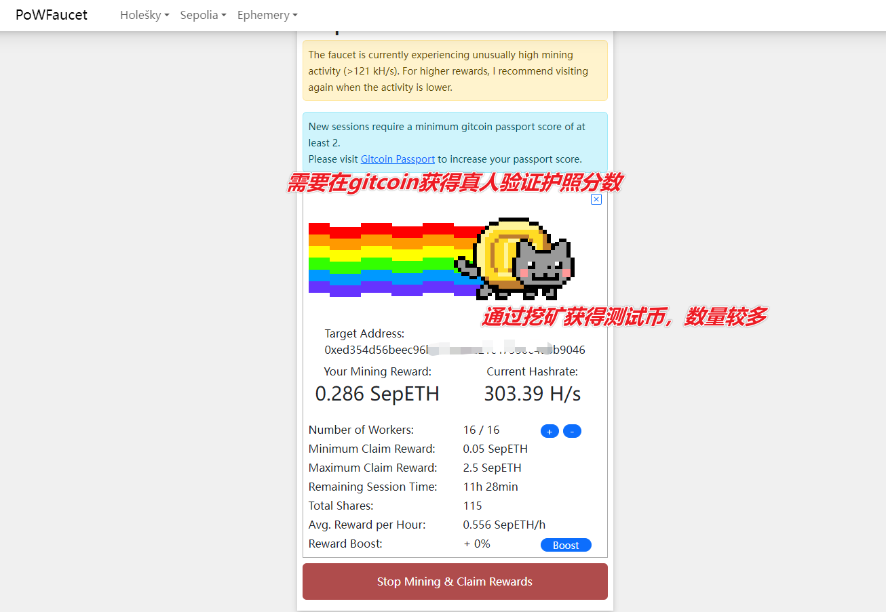
   
5. **币售网 ★★★**
   - 通过 [币售网](https://bisell.site/buy/6) 购买多种测试币，适合需要快速获取大量测试币的开发者。
   - 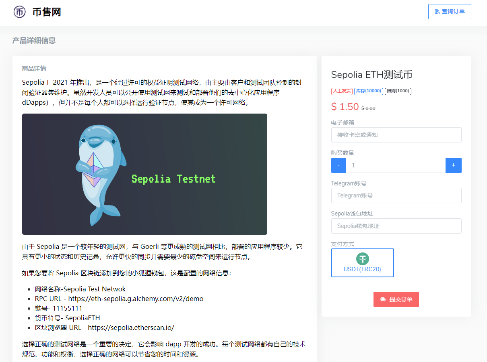
   
6. **Infura Faucet ★★★★**
   - 通过社交登录访问 [Infura Sepolia Faucet](https://faucet.quicknode.com/sepolia) 领取最多 0.5 ETH。
   - 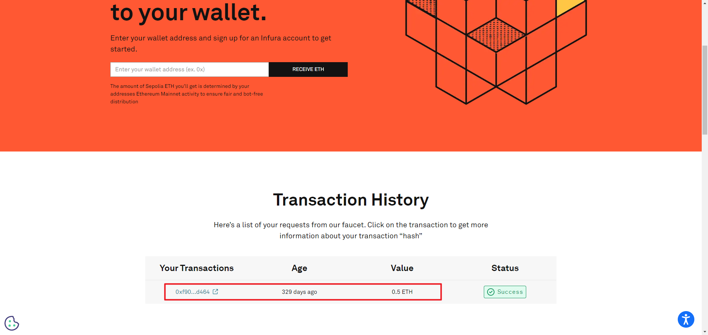
   
1. **QuickNode Sepolia Faucet ★★**
   - 通过 [QuickNode 水龙头](https://faucet.quicknode.com/unichain/sepolia) 每 12 小时可以领取 0.05 Sepolia ETH，支持 MetaMask 和 Coinbase Wallet。

2. **Chainlink Sepolia Faucet ★★★**
   - 使用 [Chainlink 水龙头](https://faucets.chain.link/sepolia) 你可以每 24 小时领取 Sepolia 测试币，需通过 GitHub 认证。
   - 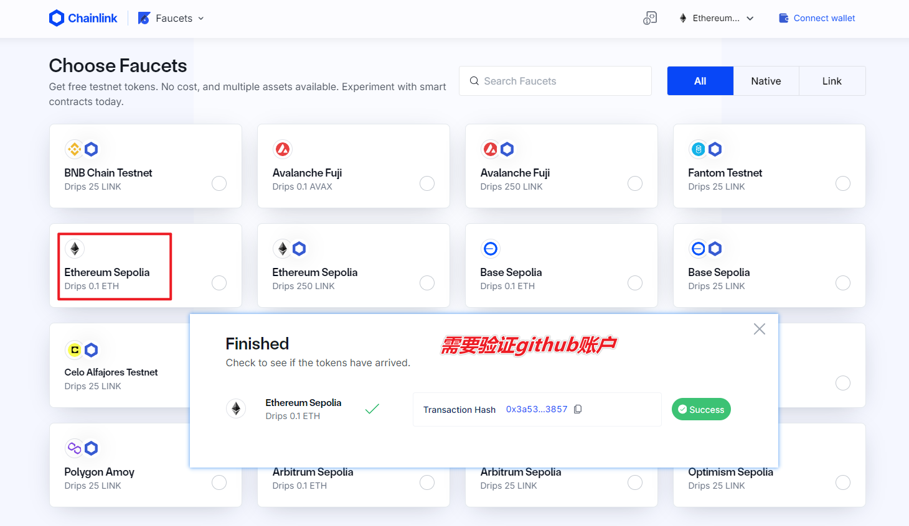
   
3. **Alchemy Sepolia Faucet ★★**
   - [Alchemy 水龙头](https://faucets.alchemy.com) 每 24 小时最多提供 1 ETH 的 Sepolia 测试币。注册一个 Alchemy 账户后即可领取，非常适合开发人员。

通过上述途径，我们已经获得了足够的测试币，下面开始hardhat网络参数的配置。

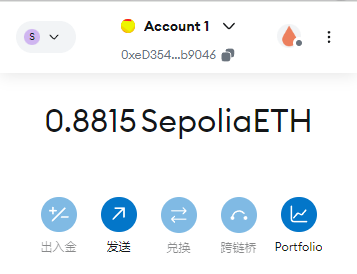

## Hardhat network 配置

我们需要查询最新的官网文档来确定配置语言的格式和参数。

### Network参数设置

官网有关远程部署测试网的代码示例：[Deploying to remote networks](https://hardhat.org/tutorial/deploying-to-a-live-network#deploying-to-remote-networks)

```js
// 这是官网样例，项目实际代码在下方
require("@nomicfoundation/hardhat-toolbox");

// 确保在执行脚本之前已设置好配置变量
const { vars } = require("hardhat/config");

// 前往 https://alchemy.com 注册账号，在其控制台中创建一个新应用，
// 并将其密钥添加到配置变量中
const ALCHEMY_API_KEY = vars.get("ALCHEMY_API_KEY");

// 将你的 Sepolia 账户私钥添加到配置变量中
// 要从 Coinbase Wallet 导出私钥，请进入设置 > 开发者设置 > 显示私钥
// 要从 MetaMask 导出私钥，请打开 MetaMask，进入账户详情 > 导出私钥
// 注意：永远不要将真实的以太币放入测试账户中
const SEPOLIA_PRIVATE_KEY = vars.get("SEPOLIA_PRIVATE_KEY");

module.exports = {
  solidity: "0.8.0",
  networks: {
    sepolia: {
      url: `https://eth-sepolia.g.alchemy.com/v2/${ALCHEMY_API_KEY}`,
      accounts: [SEPOLIA_PRIVATE_KEY]
    }
  }
};
```

为了确保私钥和 API 密钥的安全，通常会将它们存储在 `.env` 文件中，避免将敏感信息直接写入 `hardhat.config.js` 文件。初版hardhat网络配置如下：

```js
require("@nomicfoundation/hardhat-toolbox");
require('dotenv').config();  // 加载 .env 文件中的变量
const ALCHEMY_API_KEY = process.env.ALCHEMY_API_KEY;
const SEPOLIA_PRIVATE_KEY = process.env.SEPOLIA_PRIVATE_KEY;

/** @type import('hardhat/config').HardhatUserConfig */
module.exports = {
  solidity: "0.8.0",
  networks: {
    sepolia: {
      url: `https://eth-sepolia.g.alchemy.com/v2/${ALCHEMY_API_KEY}`,
      accounts: [SEPOLIA_PRIVATE_KEY]
    }
  }
};
```

然后我们去相应的节点RPC提供商获取对应的密钥。

以Alchemy为例：

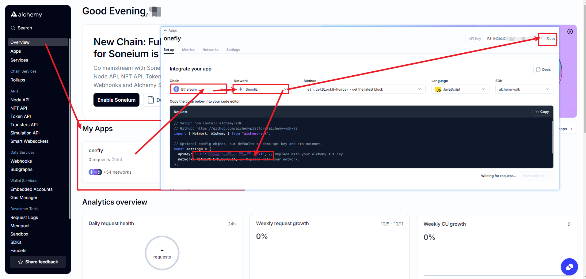

### 生成部署测试钱包

然后我们可以用`Nodejs`脚本生成一个钱包：

**安装依赖库**
首先，确保你已经安装了 Node.js 环境，并运行以下命令安装 `ethereumjs-wallet` 库：

```bash
npm install ethereumjs-wallet
```

编写`Nodejs`脚本

```js
// 导入 `ethereumjs-wallet` 库，用于生成以太坊钱包
const Wallet = require('ethereumjs-wallet').default;

// 生成一个新的以太坊钱包对象
const wallet = Wallet.generate();

// 获取钱包的私钥并转换为十六进制格式
const privateKey = wallet.getPrivateKeyString();

// 获取钱包的公钥（地址）
const publicKey = wallet.getAddressString();

// 打印生成的私钥和公钥
console.log("生成的以太坊私钥:", privateKey);
console.log("生成的以太坊地址:", publicKey);
```

**脚本使用方法：**

1. **运行脚本**
   
    - 将上面的代码保存为 `generatePrivateKey.js` 文件。
    - 在终端中运行以下命令来生成私钥和公钥：
    
   ```bash
   node generatePrivateKey.js
   ```
   
2. **输出**
   脚本将会输出生成的以太坊私钥和地址。例如：

   ```
   生成的以太坊私钥: 0x4c0883a69102937d6231471b5dbb6204fe512961708279706369249dee7e2a5d
   生成的以太坊地址: 0x9F71A70A4167c785C2b9d2Dbf4B293F0F2A0D9db
   ```
   然后请将私钥和地址保存在`.env`文件中，以备将来使用。

将其保存至根目录下的`.env`文件中：（样例 替换成自己的）

```js
ALCHEMY_API_KEY=FJ-liH2bkl2jX15eV8NXxxxxxNajVl
SEPOLIA_PRIVATE_KEY=0x4c0883a69102937d6231471b5dbb6204fe512961708279706369249dee7e2a5d
SEPOLIA_PUBLIC_KEY=0x9F71A70A4167c785C2b9d2Dbf4B293F0F2A0D9db
ETHERSCAN_API_KEY=C7AYY8EXXXXXXXXXXXZEXUID8UFZU7K
```

正式使用之前需要确保安装这个包`dotenv`哦：

```sh
npm install dotenv
```

然后我们需要用自己的**主钱包给这个私钥钱包的公钥地址转测试币**，便可以开始在测试网部署了。为了验证我们生成的私钥钱包有效，我们可以将私钥导入到小狐狸钱包中。

## 正式部署测试

本**教程对应的代码仓库**为：[**hardhat_demo**](https://github.com/ranxi2001/hardhat_demo)

最后运行：

```sh
npx hardhat run scripts/deploy.js --network sepolia
```

如果一切顺利，你应该看到已部署的合约地址。

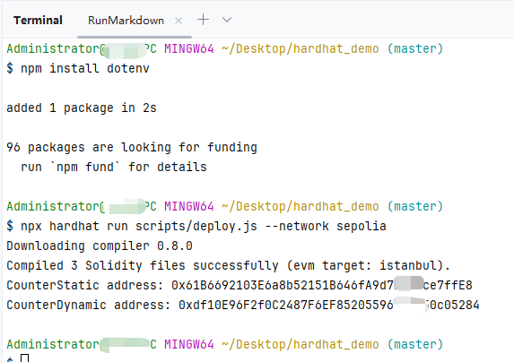

如图所示，我们的智能合约已经**成功部署在 Sepolia 链上**。

部署这两个合约**花费**了我0.011个测试网ETH，我们钱包中的EHT数量相应减少。

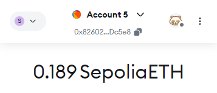

## 代码开源验证

智能代码开源会增加了合约的透明度和可靠性，是项目建立信任很重要的一个步骤。

从 Metamask 钱包右上角的菜单，我们可以在区块链浏览器中查看完全的链上交互记录。

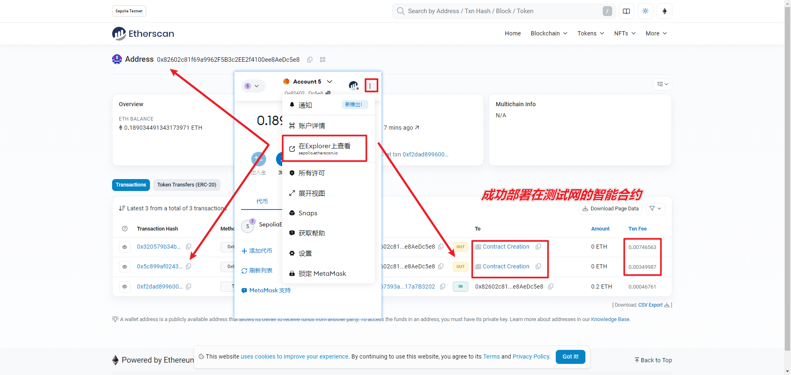

在 `hardhat-toolbox` 工具箱里，包含了 [hardhat-etherscan](https://hardhat.org/hardhat-runner/plugins/nomiclabs-hardhat-etherscan) 插件用于验证已经部署到区块链网络上的智能合约代码与源代码是否匹配，在完成验证后在区块链浏览器中合约标签上会出现✅， 如图：

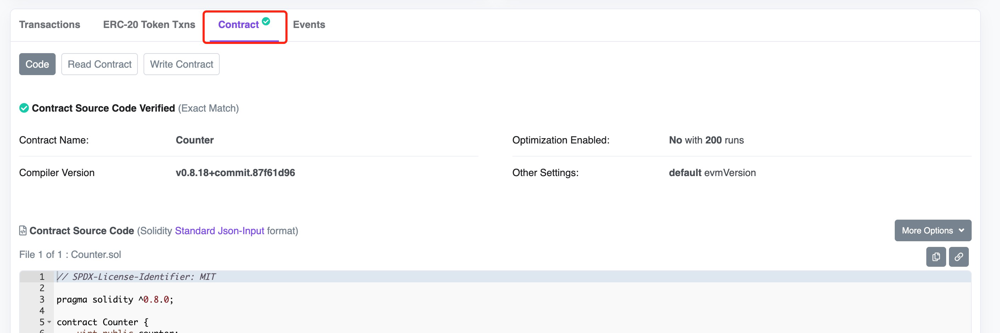

在部署智能合约时，合约字节码会被写入到区块链中，这意味着其他人无法检查合约的源代码。代码验证的过程是将已部署合约的字节码与原始Solidity代码再次编译后与部署的字节码进行比较，确保它们是一致的。

相比在区块链浏览器上上传代码验证， hardhat-etherscan 有很多优点，它会自动使用 hardhat.config.js 中设置的编译器选项，并且当代码中引用了第三方库或合约， hardhat-etherscan 能自动探测并处理。

开源验证的步骤是：

1. 安装 `hardhat-toolbox` 或 `hardhat-etherscan` ， 这一步我们这里已经完成，因为在初始化项目的时候安装了 `hardhat-toolbox` ， 如果没有安装，可以使用以下命令安装

   ```solidity
   npm install --save-dev @nomiclabs/hardhat-etherscan
   ```

2. 在 `hardhat.config.js` 中配置您的 Etherscan API 密钥和网络设置，例如：

```js
require("@nomicfoundation/hardhat-toolbox");
或
// require("@nomiclabs/hardhat-etherscan");

etherscan: {
apiKey: "C7AXXXXXXXXXXXXUID8UFZU7K"
},
```

**最终版本的**`hardhat.config.js`**配置文件格式**如下：

```js
require("@nomicfoundation/hardhat-toolbox");
require('dotenv').config();  // 加载 .env 文件中的变量
const ALCHEMY_API_KEY = process.env.ALCHEMY_API_KEY;
const SEPOLIA_PRIVATE_KEY = process.env.SEPOLIA_PRIVATE_KEY;
const ETHERSCAN_API_KEY = process.env.ETHERSCAN_API_KEY;

/** @type import('hardhat/config').HardhatUserConfig */
module.exports = {
  solidity: "0.8.0",
  networks: {
    sepolia: {
      url: `https://eth-sepolia.g.alchemy.com/v2/${ALCHEMY_API_KEY}`,
      accounts: [SEPOLIA_PRIVATE_KEY]
    }
  },
  etherscan: {
    apiKey: ETHERSCAN_API_KEY
  },
  sourcify: {
    enabled: false
  }
};
```

> 如何获取 Etherscan API 密钥？
>
> 1. 访问部署网络**对应主网**的「[Etherscan 网站](https://etherscan.io/myapikey)」，并注册一个账号（如果还没有账号的话）。
> 2. 登录你的账号并进入 Etherscan 的「[我的帐户](https://etherscan.io/myaccount)」页面：
> 3. 点击页面左侧的「API-KEYs」标签页。
> 4. 在页面右下方的「Add」部分，输入 API 密钥的名称和描述，然后「Create New API KEY」选择需要访问的 API 权限。
> 5. 点击「Add」按钮来生成 API 密钥。
>
> 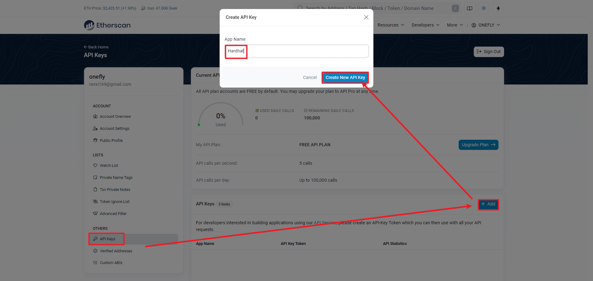

3. 执行验证命令：

   ```gherkin
   npx hardhat verify <deployed-contract-address> "参数(若有)" --network <network-name> 
   ```

   例如，要在 goerli 网络上验证合约，可以运行以下命令（合约地址为结果输出的链上部署的合约地址）：

   ```solidity
   npx hardhat verify 0x61B6692103E6a8b52151B646fA9d71D60ce7ffE8 --network sepolia
   ```
   
   该命令会为我们上传合约代码并验证其源代码。如果一切顺利（网络顺畅的话），在 Etherscan 上看到的合约被成功验证。

> 为了解决Win在终端中无法使用api的问题（mac使用增强模式），我们需要使用clash代理的终端，入口在：
>
> 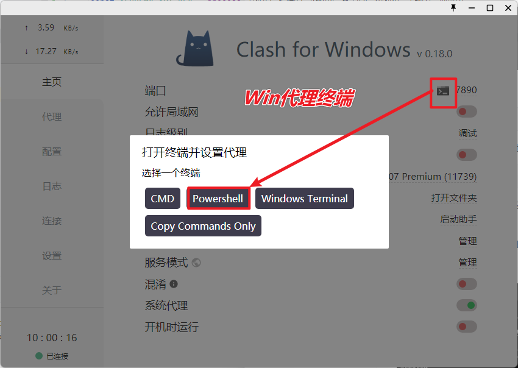

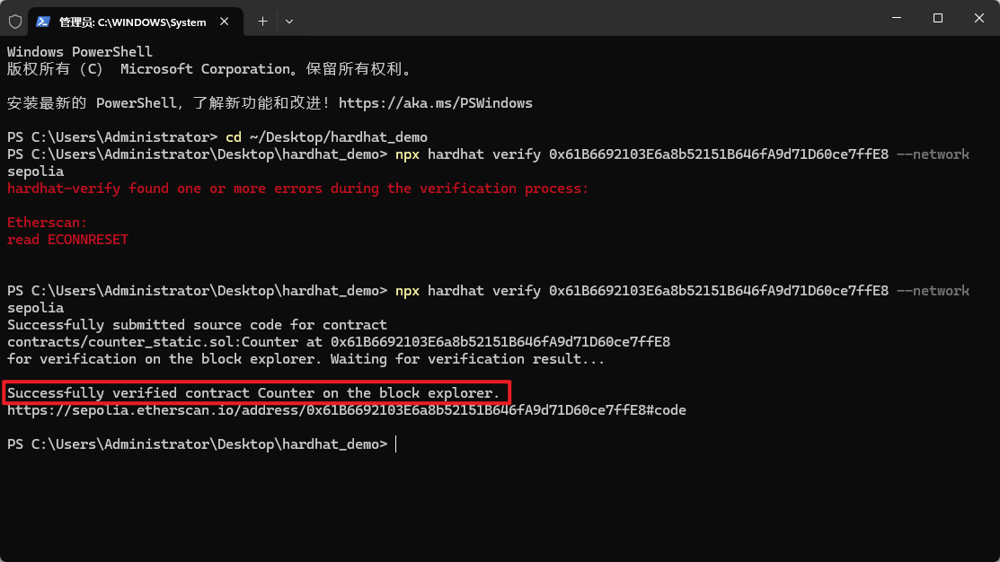

最终我们也完成了自己创建并部署的合约的验证！成功开源代码并获得✅！

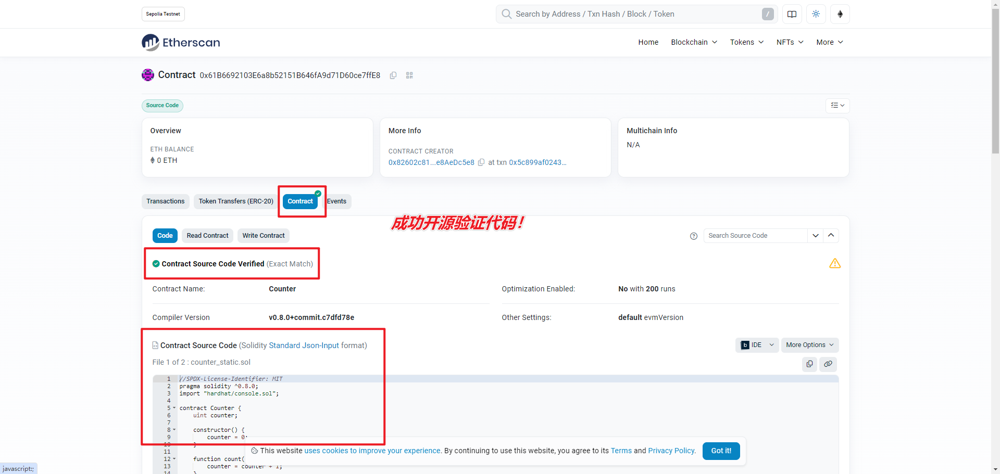

## Hardhat 插件（Plugin）的使用

上面代码开源验证时，使用了`hardhat-etherscan`插件，其实也可以使用 [hardhat-verify](https://hardhat.org/hardhat-runner/plugins/nomicfoundation-hardhat-verify#hardhat-verify) 插件。

在 https://hardhat.org/hardhat-runner/plugins 链接可以找到当前使用较多的插件。

例如：

- [hardhat-gas-reporter](https://www.npmjs.com/package/hardhat-gas-reporter) 可以对部署合约及函数执行的Gas消耗给出报告；
- [solidity-coverage](https://www.npmjs.com/package/solidity-coverage) 可以对测试覆盖率给出报告。

小结：本文讲述了测试代币的获取，PRC节点API的获取，代码部署到测试网的操作，开源验证合约的操作。

---

参考文献：

[1] 领取 ETH 测试币，Ui-Chain，https://www.binance.com/zh-CN/square/post/5039263303521

[2] 2023最新ETH测试网水龙头整理 (包含 Goerli 和 Sepolia)，加密先生，https://learnblockchain.cn/article/5784

[3] Hardhat 开发框架，DeCert.me，https://decert.me/tutorial/solidity/tools/hardhat/

