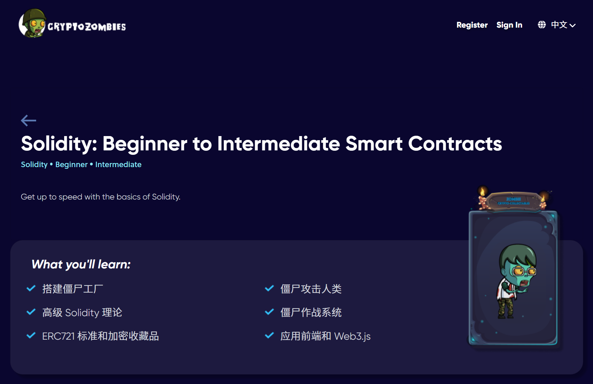

# 欢迎来到智能合约课程

## 入门：

看这个 WTF Academy

- 开发者的 Web3 开源大学 ：https://www.wtf.academy/

## 进阶：

### 智能合约编写实践

- 从僵尸web3开始学智能合约吧！
    - 链接：https://cryptozombies.io/zh/solidity

- 然后开始实战，看**成信大** **[梁培利](https://space.bilibili.com/220951871/channel/series)** 的网课：

    - [DApp设计与开发 课程笔记（一）：课程简介 - 孤飞 - 博客园 (cnblogs.com)](https://www.cnblogs.com/ranxi169/p/18245041)

    - [DApp设计与开发 课程笔记（二）：remix | hardhat | 测试驱动开发 - 孤飞 - 博客园 (cnblogs.com)](https://www.cnblogs.com/ranxi169/p/18274322)
  
  
    - [DApp设计与开发 课程笔记（三）：erc20 | erc721 - 孤飞 - 博客园 (cnblogs.com)](https://www.cnblogs.com/ranxi169/p/18274547)
  
  
    - [DApp设计与开发 课程笔记（四）：NFT交易市场合约 - 孤飞 - 博客园 (cnblogs.com)](https://www.cnblogs.com/ranxi169/p/18279014)
  
  
    - [DApp设计与开发 课程笔记（五）：Express.js后端 - 孤飞 - 博客园 (cnblogs.com)](https://www.cnblogs.com/ranxi169/p/18279104)
  
  
    - [DApp设计与开发 课程笔记（六）：NFT交易市场后端开发 - 孤飞 - 博客园 (cnblogs.com)](https://www.cnblogs.com/ranxi169/p/18280658)

### 智能合约部署实践

#### Hardhat教程

- 实战需要先学会Hardhat，我写了一篇**总体介绍**笔记： [Hardhat教程.md](./Hardhat教程.md)

- 然后，我上手**实践**写了 [Hardhat实战篇——从零创建一个项目.md](Hardhat实战篇——从零创建一个项目.md)

    - > 在本文中，我们将介绍：
      >
      > 1. 创建及配置Hardhat项目
      > 2. 编写智能合约
      > 3. Hardhat 编译合约
      > 4. 使用 [Ethers.js](https://learnblockchain.cn/ethers_v5/) 来为合约编写自动化测试
      > 5. 使用 `console.log()`调试 Solidity
      > 6. 使用 Hardhat 部署合约
      > 7. 使用 Hardhat Etherscan 进行开源验证。

- [Hardhat 中文文档](https://learnblockchain.cn/docs/hardhat/getting-started/)

- [完整的Hardhat实践教程-Boyn](https://mirror.xyz/boynn.eth/43P5YLTdDpzWHFFcQgi2iOlQFVlNfmmGf5m5bdem4XE)

## 圆满：

- 用代码例子来学Solidity：https://github.com/Web3-Club/solidity-by-example_Chinese?tab=readme-ov-file
